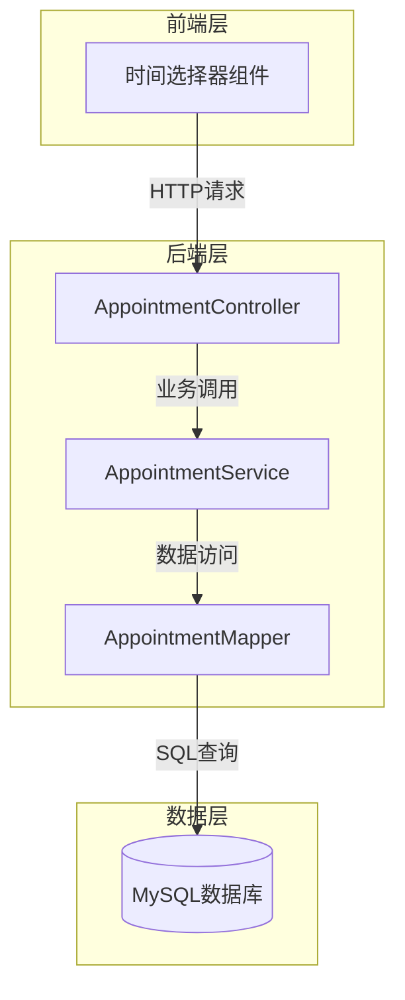
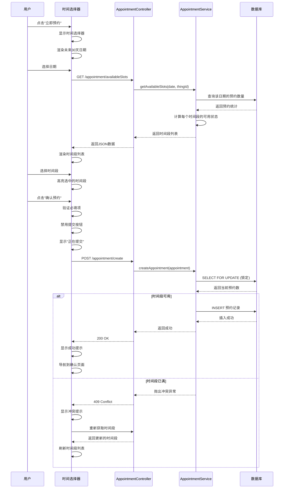

# 设计文档：预约时间选择功能

## 概述

预约时间选择功能为家政服务预约系统提供时间选择界面，允许用户在点击"立即预约"后选择预约日期和时间段。该功能是预约流程的核心环节，连接服务浏览和预约确认两个阶段。

本设计采用前后端分离架构，后端基于 Spring Boot 2.5.5 + MyBatis Plus 提供 RESTful API，前端通过 AJAX 调用后端接口完成时间选择和预约创建。

核心功能包括：
- 展示未来30天的可选日期
- 加载并显示每日可用时间段
- 验证用户选择并创建预约记录
- 处理并发预约冲突
- 提供友好的错误提示和加载反馈

## 架构

### 系统架构



### 模块划分

1. **前端模块**
   - TimeSelector 组件：日期和时间段选择UI
   - AppointmentModal 组件：预约弹窗容器
   - API Client：封装后端接口调用

2. **后端模块**
   - Controller 层：处理 HTTP 请求，参数验证
   - Service 层：业务逻辑，时间段可用性检查，并发控制
   - Mapper 层：数据库访问
   - Entity 层：数据模型定义

### 技术栈

- 后端：Spring Boot 2.5.5, MyBatis Plus, Java 8
- 数据库：MySQL
- 前端：JavaScript/Vue.js (推测基于现有项目结构)
- 通信：RESTful API, JSON

### 预约流程时序图



## 组件和接口

### 后端组件

#### 1. AppointmentController

负责处理预约时间选择相关的 HTTP 请求。

```java
@RestController
@RequestMapping("/appointment")
public class AppointmentController {
    
    /**
     * 获取指定日期的可用时间段
     * @param date 日期 (格式: yyyy-MM-dd)
     * @param thingId 服务ID
     * @return 可用时间段列表
     */
    @Access(level = AccessLevel.LOGIN)
    @RequestMapping(value = "/availableSlots", method = RequestMethod.GET)
    public APIResponse getAvailableSlots(String date, String thingId);
    
    /**
     * 创建预约
     * @param appointment 预约信息
     * @return 预约结果
     */
    @Access(level = AccessLevel.LOGIN)
    @RequestMapping(value = "/create", method = RequestMethod.POST)
    @Transactional
    public APIResponse createAppointment(Appointment appointment);
}
```

#### 2. AppointmentService

处理预约业务逻辑。

```java
public interface AppointmentService {
    
    /**
     * 获取指定日期的可用时间段
     * @param date 日期
     * @param thingId 服务ID
     * @return 时间段列表（包含可用状态）
     */
    List<TimeSlot> getAvailableSlots(String date, String thingId);
    
    /**
     * 创建预约记录
     * @param appointment 预约信息
     * @throws AppointmentConflictException 时间段已被预约
     * @throws InvalidDateException 日期无效
     */
    void createAppointment(Appointment appointment);
    
    /**
     * 检查时间段是否可用
     * @param date 日期
     * @param slotId 时间段ID
     * @return 是否可用
     */
    boolean isSlotAvailable(String date, String slotId);
}
```

#### 3. AppointmentMapper

数据访问层接口。

```java
public interface AppointmentMapper extends BaseMapper<Appointment> {
    
    /**
     * 查询指定日期和时间段的预约数量
     * @param date 日期
     * @param slotId 时间段ID
     * @return 预约数量
     */
    int countByDateAndSlot(@Param("date") String date, @Param("slotId") String slotId);
    
    /**
     * 插入预约记录（带锁）
     * @param appointment 预约信息
     */
    @Insert("INSERT INTO b_appointment ...")
    void insertWithLock(Appointment appointment);
}
```

### 前端组件

#### TimeSelector 组件

```javascript
// 时间选择器组件接口
class TimeSelector {
    /**
     * 初始化组件
     * @param {Object} options - 配置选项
     * @param {string} options.thingId - 服务ID
     * @param {Function} options.onConfirm - 确认回调
     * @param {Function} options.onCancel - 取消回调
     */
    constructor(options);
    
    /**
     * 显示时间选择器
     */
    show();
    
    /**
     * 隐藏时间选择器
     */
    hide();
    
    /**
     * 加载指定日期的时间段
     * @param {string} date - 日期
     */
    loadTimeSlots(date);
    
    /**
     * 验证并提交预约
     */
    submitAppointment();
}
```

### API 接口定义

#### 1. 获取可用时间段

**请求**
```
GET /appointment/availableSlots?date=2024-03-15&thingId=123
```

**响应**
```json
{
  "code": 200,
  "msg": "获取成功",
  "data": [
    {
      "slotId": "1",
      "startTime": "09:00",
      "endTime": "11:00",
      "available": true,
      "bookedCount": 0,
      "maxCapacity": 5
    },
    {
      "slotId": "2",
      "startTime": "14:00",
      "endTime": "16:00",
      "available": false,
      "bookedCount": 5,
      "maxCapacity": 5
    }
  ]
}
```

#### 2. 创建预约

**请求**
```
POST /appointment/create
Content-Type: application/x-www-form-urlencoded

thingId=123&userId=456&appointmentDate=2024-03-15&slotId=1&receiverName=张三&receiverPhone=13800138000&receiverAddress=北京市朝阳区&remark=请准时
```

**成功响应**
```json
{
  "code": 200,
  "msg": "预约成功",
  "data": {
    "appointmentId": "789",
    "appointmentNumber": "APT20240315001"
  }
}
```

**失败响应（时间段已满）**
```json
{
  "code": 400,
  "msg": "该时间段已被预约，请选择其他时间"
}
```

## 数据模型

### Appointment 实体

```java
@Data
@TableName("b_appointment")
public class Appointment implements Serializable {
    
    @TableId(value = "id", type = IdType.AUTO)
    private Long id;
    
    // 预约编号
    @TableField
    private String appointmentNumber;
    
    // 服务ID
    @TableField
    private String thingId;
    
    // 用户ID
    @TableField
    private String userId;
    
    // 预约日期 (yyyy-MM-dd)
    @TableField
    private String appointmentDate;
    
    // 时间段ID
    @TableField
    private String slotId;
    
    // 预约状态: 0-待服务, 1-已完成, 2-已取消
    @TableField
    private String status;
    
    // 接收人姓名
    @TableField
    private String receiverName;
    
    // 接收人电话
    @TableField
    private String receiverPhone;
    
    // 接收人地址
    @TableField
    private String receiverAddress;
    
    // 备注
    @TableField
    private String remark;
    
    // 创建时间
    @TableField
    private String createTime;
    
    // 关联字段（不存储在数据库）
    @TableField(exist = false)
    private String username;
    
    @TableField(exist = false)
    private String thingTitle;
    
    @TableField(exist = false)
    private String slotTime; // 例如: "09:00-11:00"
}
```

### TimeSlot 配置

时间段配置可以通过配置表或配置文件管理：

```java
@Data
@TableName("b_time_slot")
public class TimeSlot implements Serializable {
    
    @TableId(value = "id", type = IdType.AUTO)
    private Long id;
    
    // 时间段标识
    @TableField
    private String slotId;
    
    // 开始时间
    @TableField
    private String startTime;
    
    // 结束时间
    @TableField
    private String endTime;
    
    // 最大容量（同一时间段可预约数量）
    @TableField
    private Integer maxCapacity;
    
    // 是否启用
    @TableField
    private Boolean enabled;
    
    // 排序
    @TableField
    private Integer sortOrder;
}
```

### 数据库表结构

```sql
-- 预约表
CREATE TABLE b_appointment (
    id BIGINT AUTO_INCREMENT PRIMARY KEY,
    appointment_number VARCHAR(50) NOT NULL UNIQUE COMMENT '预约编号',
    thing_id VARCHAR(20) NOT NULL COMMENT '服务ID',
    user_id VARCHAR(20) NOT NULL COMMENT '用户ID',
    appointment_date VARCHAR(10) NOT NULL COMMENT '预约日期',
    slot_id VARCHAR(10) NOT NULL COMMENT '时间段ID',
    status VARCHAR(1) DEFAULT '0' COMMENT '状态: 0-待服务, 1-已完成, 2-已取消',
    receiver_name VARCHAR(50) NOT NULL COMMENT '接收人姓名',
    receiver_phone VARCHAR(20) NOT NULL COMMENT '接收人电话',
    receiver_address VARCHAR(200) NOT NULL COMMENT '接收人地址',
    remark VARCHAR(500) COMMENT '备注',
    create_time DATETIME DEFAULT CURRENT_TIMESTAMP COMMENT '创建时间',
    INDEX idx_date_slot (appointment_date, slot_id),
    INDEX idx_user (user_id),
    INDEX idx_thing (thing_id)
) ENGINE=InnoDB DEFAULT CHARSET=utf8mb4 COMMENT='预约表';

-- 时间段配置表
CREATE TABLE b_time_slot (
    id BIGINT AUTO_INCREMENT PRIMARY KEY,
    slot_id VARCHAR(10) NOT NULL UNIQUE COMMENT '时间段标识',
    start_time VARCHAR(5) NOT NULL COMMENT '开始时间',
    end_time VARCHAR(5) NOT NULL COMMENT '结束时间',
    max_capacity INT DEFAULT 5 COMMENT '最大容量',
    enabled TINYINT(1) DEFAULT 1 COMMENT '是否启用',
    sort_order INT DEFAULT 0 COMMENT '排序',
    INDEX idx_enabled (enabled)
) ENGINE=InnoDB DEFAULT CHARSET=utf8mb4 COMMENT='时间段配置表';
```


## 正确性属性

属性是一个特征或行为，应该在系统的所有有效执行中保持为真——本质上是关于系统应该做什么的正式声明。属性作为人类可读规范和机器可验证正确性保证之间的桥梁。

### 属性 1: 日期范围正确性

*对于任意*当前日期，时间选择器返回的可选日期列表应该恰好包含从当前日期开始的未来30天，且不包含任何过去的日期。

**验证需求: 1.2, 2.3**

### 属性 2: 时间段加载完整性

*对于任意*有效的日期选择，系统应该返回该日期的完整时间段列表，且每个时间段都包含可用状态信息（可预约数量、最大容量）。

**验证需求: 1.3, 2.2, 3.3**

### 属性 3: 选择状态一致性

*对于任意*用户选择操作（日期或时间段），被选中的项应该在UI上被高亮显示，且只有一个项处于选中状态。

**验证需求: 2.1, 3.1**

### 属性 4: 时间段可用性正确性

*对于任意*时间段，如果该时间段的已预约数量达到最大容量，则该时间段应该被标记为不可用并在UI上禁用。

**验证需求: 3.2**

### 属性 5: 预约创建完整性

*对于任意*有效的预约请求（包含用户ID、服务ID、日期、时间段），系统创建的预约记录应该包含所有这些必需字段以及接收人信息。

**验证需求: 4.1, 4.2**

### 属性 6: 预约成功反馈

*对于任意*成功创建的预约，系统应该显示成功提示信息并导航到预约确认页面。

**验证需求: 4.3, 4.4**

### 属性 7: 输入验证完整性

*对于任意*预约提交请求，只有当日期和时间段都已选择时，系统才应该允许提交；否则应该阻止提交并显示相应的错误提示。

**验证需求: 5.3**

### 属性 8: 取消操作清理

*对于任意*取消操作，系统应该清除所有已选择的日期和时间段信息，将选择器恢复到初始状态。

**验证需求: 6.2**

### 属性 9: 错误信息展示

*对于任意*预约创建失败的情况，系统应该向用户显示具体的错误信息，说明失败原因。

**验证需求: 7.1**

### 属性 10: 并发冲突处理

*对于任意*预约请求，如果在提交时所选时间段已被其他用户预约（并发冲突），系统应该拒绝该预约、显示冲突提示信息、并刷新该日期的可用时间段列表。

**验证需求: 7.3**

### 属性 11: 错误恢复状态保持

*对于任意*预约提交错误，系统应该保留用户已选择的日期信息，避免用户重新选择。

**验证需求: 7.4**

### 属性 12: 加载状态管理

*对于任意*异步操作（加载时间段或创建预约），在操作进行期间应该显示加载指示器，操作完成后应该移除加载指示器并显示结果内容。

**验证需求: 8.1, 8.4**

### 属性 13: 重复提交防护

*对于任意*预约提交请求，在系统处理该请求期间，"确认预约"按钮应该被禁用，防止用户重复提交。

**验证需求: 8.3**

### 属性 14: 预约编号唯一性

*对于任意*两个不同的预约记录，它们的预约编号应该是唯一的，不存在重复。

**验证需求: 4.2（隐含）**

## 错误处理

### 错误类型和处理策略

#### 1. 客户端验证错误

**场景**: 用户未完成必填选择就尝试提交

**处理**:
- 在客户端立即验证，不发送请求到服务器
- 显示友好的提示信息（"请选择预约日期"、"请选择预约时间段"）
- 高亮未填写的必填项
- 保持用户已输入的其他信息

**实现**:
```javascript
function validateAppointment() {
    if (!selectedDate) {
        showError("请选择预约日期");
        return false;
    }
    if (!selectedSlot) {
        showError("请选择预约时间段");
        return false;
    }
    return true;
}
```

#### 2. 并发冲突错误

**场景**: 用户选择的时间段在提交时已被其他用户预约

**处理**:
- 服务端使用数据库行锁或乐观锁检测冲突
- 返回特定错误码（如 409 Conflict）
- 客户端显示提示："该时间段已被预约，请选择其他时间"
- 自动刷新该日期的可用时间段
- 保留用户选择的日期

**实现**:
```java
@Transactional
public void createAppointment(Appointment appointment) {
    // 使用 SELECT FOR UPDATE 锁定记录
    int count = mapper.countByDateAndSlotWithLock(
        appointment.getAppointmentDate(), 
        appointment.getSlotId()
    );
    
    TimeSlot slot = slotService.getById(appointment.getSlotId());
    
    if (count >= slot.getMaxCapacity()) {
        throw new AppointmentConflictException("该时间段已被预约");
    }
    
    mapper.insert(appointment);
}
```

#### 3. 网络错误

**场景**: 请求超时或网络连接失败

**处理**:
- 捕获网络异常
- 显示提示："网络连接失败，请稍后重试"
- 提供"重试"按钮
- 保留用户所有已输入信息

**实现**:
```javascript
async function createAppointment(data) {
    try {
        const response = await fetch('/appointment/create', {
            method: 'POST',
            body: new URLSearchParams(data),
            timeout: 10000
        });
        return await response.json();
    } catch (error) {
        if (error.name === 'TypeError' || error.name === 'NetworkError') {
            showError("网络连接失败，请稍后重试");
        }
        throw error;
    }
}
```

#### 4. 服务器错误

**场景**: 服务器内部错误（500）

**处理**:
- 记录详细错误日志（包括堆栈跟踪）
- 向用户显示通用错误信息："系统繁忙，请稍后重试"
- 不暴露技术细节给用户
- 保留用户已输入信息

**实现**:
```java
@RestControllerAdvice
public class AppointmentExceptionHandler {
    
    @ExceptionHandler(AppointmentConflictException.class)
    public APIResponse handleConflict(AppointmentConflictException e) {
        return new APIResponse(409, e.getMessage());
    }
    
    @ExceptionHandler(Exception.class)
    public APIResponse handleGeneral(Exception e) {
        logger.error("预约创建失败", e);
        return new APIResponse(500, "系统繁忙，请稍后重试");
    }
}
```

#### 5. 业务规则错误

**场景**: 违反业务规则（如选择过去的日期、无效的时间段ID）

**处理**:
- 服务端验证所有业务规则
- 返回具体的错误信息
- 客户端显示错误并允许用户修正

**实现**:
```java
public void validateAppointment(Appointment appointment) {
    LocalDate appointmentDate = LocalDate.parse(appointment.getAppointmentDate());
    if (appointmentDate.isBefore(LocalDate.now())) {
        throw new InvalidDateException("不能预约过去的日期");
    }
    
    TimeSlot slot = slotService.getById(appointment.getSlotId());
    if (slot == null || !slot.getEnabled()) {
        throw new InvalidSlotException("无效的时间段");
    }
}
```

### 错误日志记录

所有错误都应该被记录，包含以下信息：
- 时间戳
- 用户ID
- 请求参数
- 错误类型和消息
- 堆栈跟踪（服务器错误）

```java
logger.error("预约创建失败 - 用户: {}, 日期: {}, 时间段: {}, 错误: {}", 
    appointment.getUserId(),
    appointment.getAppointmentDate(),
    appointment.getSlotId(),
    e.getMessage(),
    e
);
```

## 测试策略

### 测试方法

本功能采用双重测试方法，结合单元测试和基于属性的测试，以确保全面覆盖。

#### 单元测试

单元测试专注于具体示例、边界情况和集成点：

1. **具体示例测试**
   - 测试点击"立即预约"按钮显示时间选择器（需求 1.1）
   - 测试界面包含"确认预约"和"取消"按钮（需求 1.4）
   - 测试未选择日期时显示特定错误提示（需求 5.1）
   - 测试未选择时间段时显示特定错误提示（需求 5.2）
   - 测试点击"取消"按钮关闭界面（需求 6.1）
   - 测试点击外部区域关闭界面（需求 6.4）
   - 测试网络错误显示特定提示（需求 7.2）

2. **边界情况测试**
   - 测试日期边界（今天、30天后、31天后）
   - 测试时间段容量边界（0个预约、最大容量-1、最大容量）
   - 测试空字符串和 null 值处理
   - 测试特殊字符在备注字段中的处理

3. **集成测试**
   - 测试完整的预约流程（选择日期 → 选择时间段 → 提交 → 确认）
   - 测试与用户认证系统的集成
   - 测试与服务信息系统的集成

#### 基于属性的测试

基于属性的测试验证跨所有输入的通用属性，使用随机生成的测试数据。

**测试框架**: JUnit 5 + jqwik (Java 属性测试库)

**配置**: 每个属性测试最少运行 100 次迭代

**标签格式**: 每个测试用注释标记对应的设计属性
```java
// Feature: appointment-time-selection, Property 1: 日期范围正确性
```

### 属性测试实现示例

```java
import net.jqwik.api.*;

class AppointmentPropertyTests {
    
    // Feature: appointment-time-selection, Property 1: 日期范围正确性
    @Property(tries = 100)
    void dateRangeShouldBe30DaysFromNow(@ForAll("currentDates") LocalDate currentDate) {
        List<LocalDate> availableDates = timeSelector.getAvailableDates(currentDate);
        
        // 验证数量
        assertThat(availableDates).hasSize(30);
        
        // 验证范围
        assertThat(availableDates.get(0)).isEqualTo(currentDate);
        assertThat(availableDates.get(29)).isEqualTo(currentDate.plusDays(29));
        
        // 验证没有过去的日期
        assertThat(availableDates).allMatch(date -> !date.isBefore(currentDate));
    }
    
    @Provide
    Arbitrary<LocalDate> currentDates() {
        return Dates.dates().between(
            LocalDate.of(2024, 1, 1),
            LocalDate.of(2025, 12, 31)
        );
    }
    
    // Feature: appointment-time-selection, Property 4: 时间段可用性正确性
    @Property(tries = 100)
    void fullSlotsShouldBeDisabled(
        @ForAll("dates") String date,
        @ForAll("slots") TimeSlot slot,
        @ForAll("bookingCounts") int bookingCount
    ) {
        // 设置预约数量
        setupBookings(date, slot.getSlotId(), bookingCount);
        
        List<TimeSlotDTO> slots = service.getAvailableSlots(date, "thing123");
        TimeSlotDTO targetSlot = slots.stream()
            .filter(s -> s.getSlotId().equals(slot.getSlotId()))
            .findFirst()
            .orElseThrow();
        
        // 验证：如果预约数达到最大容量，则不可用
        if (bookingCount >= slot.getMaxCapacity()) {
            assertThat(targetSlot.isAvailable()).isFalse();
        } else {
            assertThat(targetSlot.isAvailable()).isTrue();
        }
    }
    
    // Feature: appointment-time-selection, Property 10: 并发冲突处理
    @Property(tries = 100)
    void concurrentBookingShouldBeRejected(
        @ForAll("appointments") Appointment appointment
    ) {
        // 先创建一个预约，填满时间段
        fillTimeSlot(appointment.getAppointmentDate(), appointment.getSlotId());
        
        // 尝试再次预约同一时间段
        assertThatThrownBy(() -> service.createAppointment(appointment))
            .isInstanceOf(AppointmentConflictException.class)
            .hasMessageContaining("该时间段已被预约");
        
        // 验证时间段列表被刷新
        List<TimeSlotDTO> refreshedSlots = service.getAvailableSlots(
            appointment.getAppointmentDate(), 
            appointment.getThingId()
        );
        
        TimeSlotDTO targetSlot = refreshedSlots.stream()
            .filter(s -> s.getSlotId().equals(appointment.getSlotId()))
            .findFirst()
            .orElseThrow();
        
        assertThat(targetSlot.isAvailable()).isFalse();
    }
    
    // Feature: appointment-time-selection, Property 14: 预约编号唯一性
    @Property(tries = 100)
    void appointmentNumbersShouldBeUnique(
        @ForAll("appointments") List<Appointment> appointments
    ) {
        Assume.that(appointments.size() >= 2);
        
        // 创建多个预约
        List<String> appointmentNumbers = appointments.stream()
            .map(apt -> {
                service.createAppointment(apt);
                return mapper.selectById(apt.getId()).getAppointmentNumber();
            })
            .collect(Collectors.toList());
        
        // 验证所有预约编号唯一
        assertThat(appointmentNumbers).doesNotHaveDuplicates();
    }
}
```

### 前端测试

前端测试使用 Jest + Vue Test Utils（假设使用 Vue.js）：

```javascript
describe('TimeSelector Component', () => {
    // 单元测试示例
    it('should show time selector when "立即预约" button is clicked', () => {
        const wrapper = mount(ServiceDetail);
        wrapper.find('.book-now-btn').trigger('click');
        expect(wrapper.find('.time-selector').isVisible()).toBe(true);
    });
    
    // 属性测试示例（使用 fast-check）
    it('Property: selected items should be highlighted', () => {
        fc.assert(
            fc.property(
                fc.date(), // 随机日期
                (date) => {
                    const wrapper = mount(TimeSelector);
                    wrapper.vm.selectDate(date);
                    
                    const selectedElements = wrapper.findAll('.date-item.selected');
                    expect(selectedElements).toHaveLength(1);
                    expect(selectedElements[0].text()).toContain(formatDate(date));
                }
            ),
            { numRuns: 100 }
        );
    });
});
```

### 测试覆盖率目标

- 代码覆盖率：≥ 80%
- 分支覆盖率：≥ 75%
- 所有正确性属性：100% 实现为属性测试
- 所有边界情况：100% 覆盖

### 测试执行

```bash
# 运行所有测试
mvn test

# 运行属性测试
mvn test -Dtest=*PropertyTests

# 生成覆盖率报告
mvn jacoco:report
```

### 性能测试

除了功能测试，还应进行性能测试：

1. **并发测试**: 模拟多个用户同时预约同一时间段
2. **负载测试**: 测试系统在高负载下的响应时间
3. **压力测试**: 确定系统的最大容量

```java
@Test
void concurrentBookingStressTest() throws InterruptedException {
    int threadCount = 50;
    CountDownLatch latch = new CountDownLatch(threadCount);
    AtomicInteger successCount = new AtomicInteger(0);
    AtomicInteger conflictCount = new AtomicInteger(0);
    
    for (int i = 0; i < threadCount; i++) {
        new Thread(() -> {
            try {
                Appointment apt = createTestAppointment();
                service.createAppointment(apt);
                successCount.incrementAndGet();
            } catch (AppointmentConflictException e) {
                conflictCount.incrementAndGet();
            } finally {
                latch.countDown();
            }
        }).start();
    }
    
    latch.await();
    
    // 验证：成功数 + 冲突数 = 总数
    assertThat(successCount.get() + conflictCount.get()).isEqualTo(threadCount);
    
    // 验证：成功数不超过时间段容量
    assertThat(successCount.get()).isLessThanOrEqualTo(5); // 假设容量为5
}
```


## 实现建议

### 并发控制

为了处理多用户同时预约同一时间段的情况，推荐使用以下策略：

1. **数据库行锁（推荐）**
   ```sql
   SELECT COUNT(*) FROM b_appointment 
   WHERE appointment_date = ? AND slot_id = ?
   FOR UPDATE;
   ```
   在事务中使用 `SELECT FOR UPDATE` 锁定相关记录，确保并发安全。

2. **乐观锁（备选）**
   在 `b_time_slot` 表添加 `version` 字段，使用 MyBatis Plus 的 `@Version` 注解。

3. **Redis 分布式锁（高并发场景）**
   如果系统需要支持更高并发，可以使用 Redis 实现分布式锁：
   ```java
   String lockKey = "appointment:lock:" + date + ":" + slotId;
   boolean locked = redisTemplate.opsForValue()
       .setIfAbsent(lockKey, "1", 10, TimeUnit.SECONDS);
   ```

### 性能优化

1. **缓存时间段配置**
   时间段配置很少变化，可以使用 Redis 缓存：
   ```java
   @Cacheable(value = "timeSlots", key = "'all'")
   public List<TimeSlot> getAllTimeSlots() {
       return mapper.selectList(null);
   }
   ```

2. **批量查询优化**
   获取可用时间段时，使用一次查询获取所有时间段的预约统计：
   ```sql
   SELECT slot_id, COUNT(*) as count 
   FROM b_appointment 
   WHERE appointment_date = ? AND status = '0'
   GROUP BY slot_id;
   ```

3. **数据库索引**
   确保以下索引存在：
   - `idx_date_slot` on `(appointment_date, slot_id)`
   - `idx_user` on `(user_id)`
   - `idx_status` on `(status)`

### 预约编号生成

推荐使用以下格式生成唯一的预约编号：
```java
public String generateAppointmentNumber() {
    // 格式: APT + 日期(yyyyMMdd) + 6位序列号
    String date = LocalDate.now().format(DateTimeFormatter.BASIC_ISO_DATE);
    String sequence = String.format("%06d", getNextSequence());
    return "APT" + date + sequence;
}
```

可以使用数据库序列或 Redis 自增来生成序列号。

### 前端状态管理

建议使用 Vuex 或类似的状态管理库来管理预约流程的状态：

```javascript
const appointmentStore = {
    state: {
        selectedDate: null,
        selectedSlot: null,
        availableSlots: [],
        loading: false,
        error: null
    },
    mutations: {
        setSelectedDate(state, date) {
            state.selectedDate = date;
            state.selectedSlot = null; // 重置时间段选择
        },
        setSelectedSlot(state, slot) {
            state.selectedSlot = slot;
        },
        setAvailableSlots(state, slots) {
            state.availableSlots = slots;
        },
        setLoading(state, loading) {
            state.loading = loading;
        },
        setError(state, error) {
            state.error = error;
        }
    },
    actions: {
        async loadTimeSlots({ commit }, { date, thingId }) {
            commit('setLoading', true);
            try {
                const response = await api.getAvailableSlots(date, thingId);
                commit('setAvailableSlots', response.data);
            } catch (error) {
                commit('setError', error.message);
            } finally {
                commit('setLoading', false);
            }
        }
    }
};
```

### 用户体验优化

1. **加载骨架屏**
   在加载时间段时显示骨架屏而不是简单的加载指示器，提升用户体验。

2. **防抖处理**
   如果允许用户快速切换日期，使用防抖避免频繁请求：
   ```javascript
   const loadTimeSlotsDebounced = debounce(loadTimeSlots, 300);
   ```

3. **乐观更新**
   在提交预约后，立即更新 UI 显示"预约成功"，同时在后台完成实际提交。如果失败，再回滚 UI 状态。

4. **键盘导航**
   支持键盘操作（方向键选择日期/时间段，Enter 确认），提升可访问性。

### 安全考虑

1. **权限验证**
   确保用户只能为自己创建预约，在 Service 层验证 `userId` 与当前登录用户一致。

2. **参数验证**
   使用 JSR-303 验证注解：
   ```java
   @Data
   public class AppointmentRequest {
       @NotBlank(message = "服务ID不能为空")
       private String thingId;
       
       @NotBlank(message = "预约日期不能为空")
       @Pattern(regexp = "\\d{4}-\\d{2}-\\d{2}", message = "日期格式错误")
       private String appointmentDate;
       
       @NotBlank(message = "时间段不能为空")
       private String slotId;
       
       @NotBlank(message = "接收人姓名不能为空")
       @Size(max = 50, message = "姓名长度不能超过50")
       private String receiverName;
       
       @NotBlank(message = "联系电话不能为空")
       @Pattern(regexp = "1[3-9]\\d{9}", message = "手机号格式错误")
       private String receiverPhone;
   }
   ```

3. **SQL 注入防护**
   使用 MyBatis Plus 的参数化查询，避免字符串拼接 SQL。

4. **XSS 防护**
   对用户输入的备注等文本字段进行 HTML 转义。

### 监控和日志

1. **关键操作日志**
   记录所有预约创建、取消操作：
   ```java
   logger.info("预约创建 - 用户: {}, 服务: {}, 日期: {}, 时间段: {}, 预约号: {}", 
       userId, thingId, date, slotId, appointmentNumber);
   ```

2. **性能监控**
   监控关键接口的响应时间和错误率：
   - `/appointment/availableSlots` 响应时间
   - `/appointment/create` 成功率
   - 并发冲突发生频率

3. **告警设置**
   - 预约创建失败率超过 5%
   - 接口响应时间超过 2 秒
   - 数据库连接池耗尽

## 未来扩展

### 可能的功能增强

1. **预约提醒**
   - 预约前一天发送短信/邮件提醒
   - 预约前2小时发送推送通知

2. **预约修改**
   - 允许用户在服务开始前修改预约时间
   - 记录修改历史

3. **预约评价**
   - 服务完成后允许用户评价
   - 评价数据用于服务质量改进

4. **智能推荐**
   - 根据用户历史预约习惯推荐时间段
   - 显示热门时间段

5. **多服务预约**
   - 支持一次预约多个服务
   - 自动计算服务时长和时间段

6. **预约队列**
   - 当时间段已满时，允许用户加入等候队列
   - 有空位时自动通知

### 技术债务

在初始实现中可以接受的简化，但应在后续迭代中改进：

1. **时间段配置硬编码**
   初期可以在代码中硬编码时间段配置，后续应移到数据库或配置中心。

2. **简单的序列号生成**
   初期可以使用数据库自增 ID，后续应使用分布式 ID 生成器（如雪花算法）。

3. **同步处理**
   初期所有操作都是同步的，后续可以考虑异步处理（如发送通知）。

4. **单机部署**
   初期可能是单机部署，后续需要考虑分布式场景下的一致性问题。

## 总结

本设计文档详细描述了预约时间选择功能的架构、组件、接口、数据模型、正确性属性、错误处理和测试策略。

关键设计决策：
- 采用前后端分离架构，提供 RESTful API
- 使用数据库行锁处理并发冲突
- 实现 14 个正确性属性，确保系统行为符合需求
- 采用双重测试策略（单元测试 + 属性测试）
- 提供友好的错误处理和用户反馈

实现时应特别注意：
- 并发控制的正确性
- 用户体验的流畅性
- 错误处理的完整性
- 安全性和数据验证

该设计为后续的任务分解和实现提供了清晰的指导。
